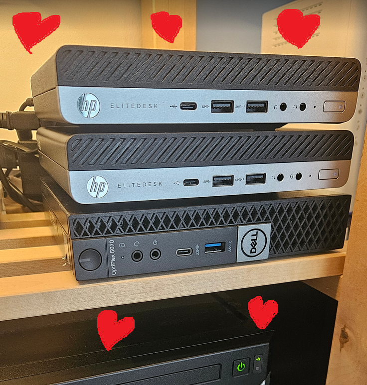

# Home kubernetes cluster

Manifest files for my kubernetes cluster.

### Installing helm charts
<code>helm install -n \<namespace> -f <values_file> <release_name> <app_dir></code>

### Todo
<ul> 
<li>Add chart dependency charts</li>
<li>Helm charts (crowdsec)</li>
<li>Template values files</li>
<li>Live/readiness checks (redis)</li>
<li>Network policies</li>
<li>Authelia redirect on forward auth</li>
<li>Jellyfin + remote ffmpeg?</li>
</ul>

